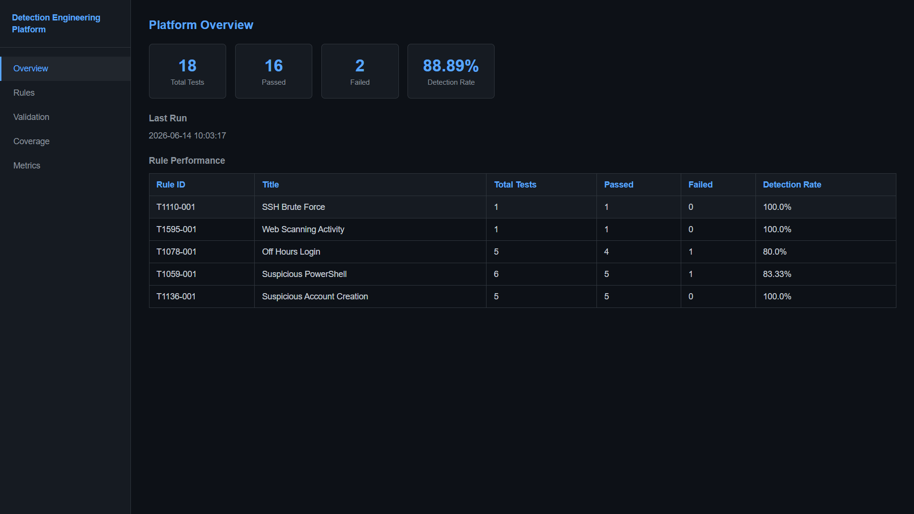
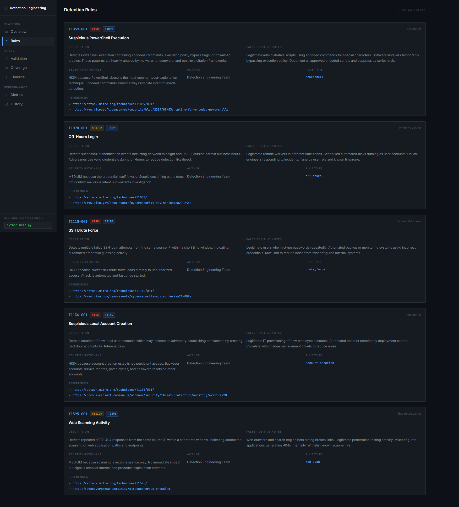
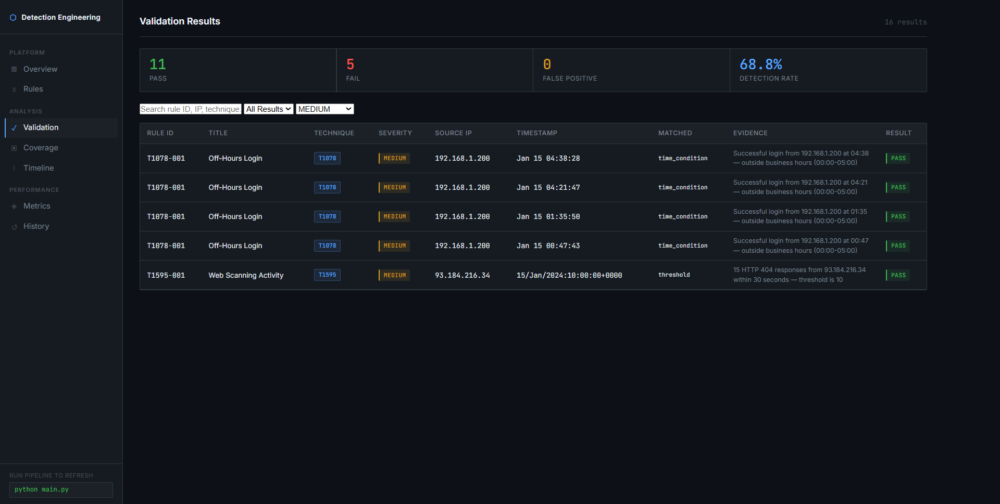
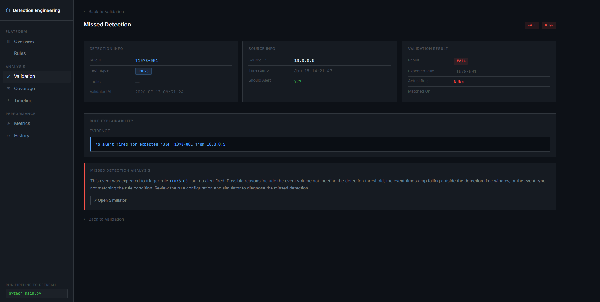
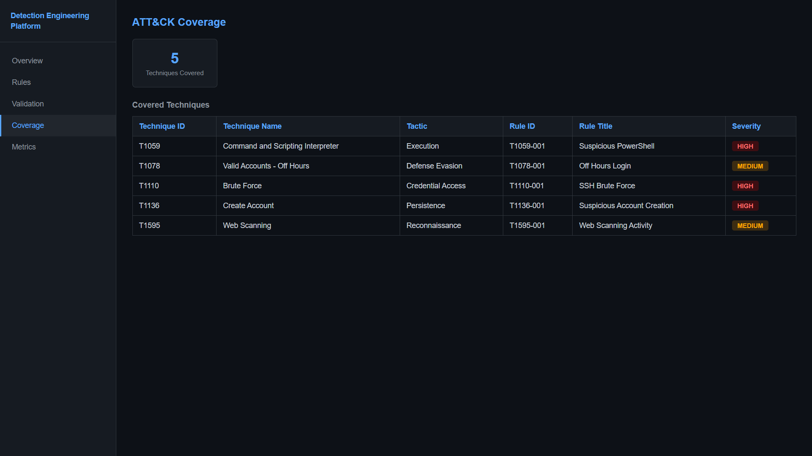
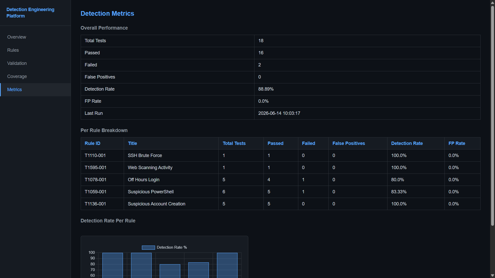
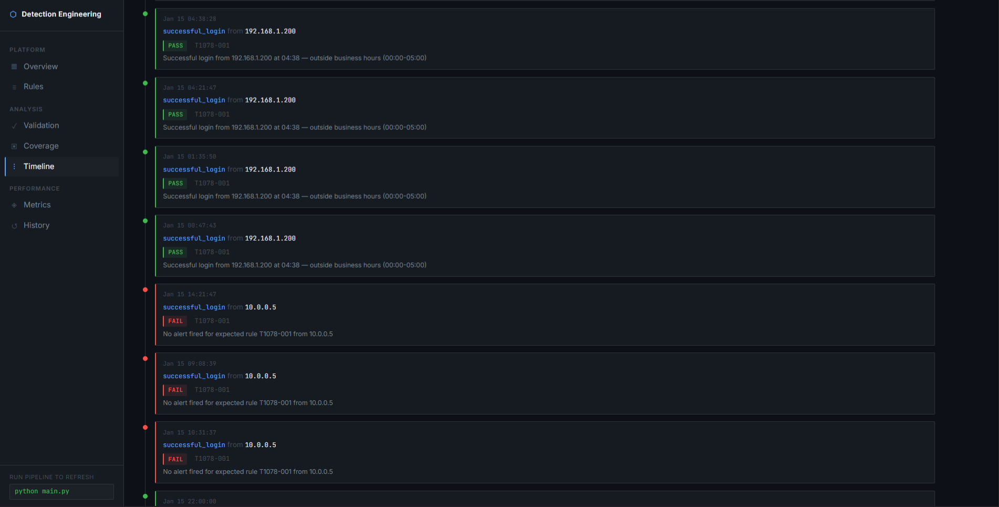
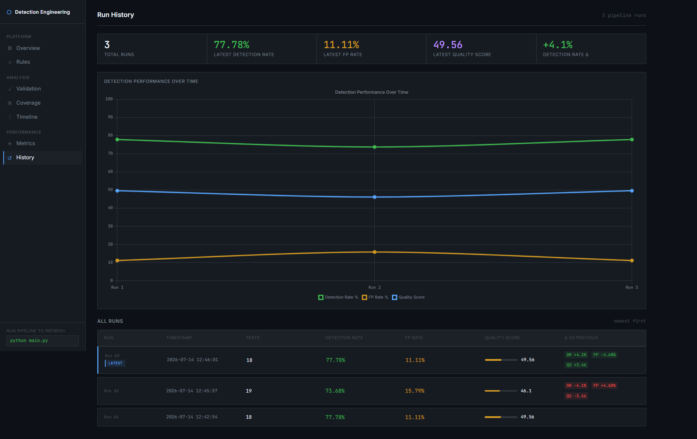
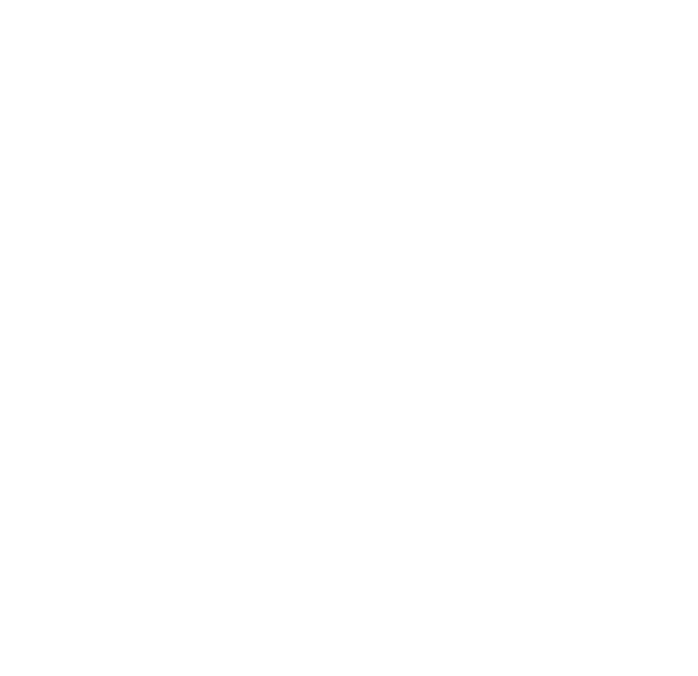

# Detection Engineering Toolkit

A Python and Flask platform for building, testing, and validating detection rules 
against simulated attack scenarios. Rules are defined in JSON with full MITRE 
ATT&CK metadata, tested against simulated events, and validated automatically 
using PASS, FAIL, and FALSE POSITIVE outcomes.

---

## Screenshots

### Overview


### Detection Rules


### Validation Results


### Validation Detail


### ATT&CK Coverage


### Detection Metrics


### Event Timeline


### Run History


---

## Features

- JSON rule repository — rules defined entirely in JSON with no Python changes required to add new ones
- Detection-as-Code metadata — each rule includes author, description, severity rationale, false positive notes, and references
- MITRE ATT&CK mapping across five techniques and four tactics
- Attack simulation framework — five scenarios generating both malicious and benign events
- Automatic validation — every detection result classified as PASS, FAIL, or FALSE POSITIVE
- Rule explainability — every alert records which condition matched, the matched value, and a human-readable evidence summary
- Missed detection tracking — events expected to trigger an alert but did not are recorded and explained
- Detection quality score — composite metric combining detection rate, false positive rate, and severity
- ATT&CK coverage gap analysis — identifies common techniques without detection coverage
- Run history with delta tracking — each pipeline run stores metrics and computes change from previous run
- Event timeline — chronological view of all simulated events annotated with detection outcomes
- Flask dashboard with Chart.js visualizations

---

## Detection Rules

| Rule ID | Rule Name | Technique | Tactic | Trigger |
|---------|-----------|-----------|--------|---------|
| T1110-001 | SSH Brute Force | T1110 | Credential Access | 5+ failed logins from one IP within 60 seconds |
| T1595-001 | Web Scanning Activity | T1595 | Reconnaissance | 10+ HTTP 404 responses from one IP within 30 seconds |
| T1078-001 | Off-Hours Login | T1078 | Defense Evasion | Successful login between 00:00 and 05:00 |
| T1059-001 | Suspicious PowerShell | T1059 | Execution | PowerShell command containing encoded, bypass, hidden, or download keywords |
| T1136-001 | Suspicious Account Creation | T1136 | Persistence | Any account creation event |

Each rule is defined in `rules/` as a standalone JSON file. Adding a new rule 
requires only creating a JSON file — no Python changes needed.

---

## Detection Quality Score

Each rule receives a quality score between 0 and 100 calculated from three factors:

```
Quality Score = (Detection Rate × 0.50) − (FP Rate × 0.30) + (Severity Bonus × 0.20)

Severity Bonus:  LOW = 15 · MEDIUM = 40 · HIGH = 70 · CRITICAL = 90
Score range:     0 – 100 (capped)
```

A score above 70 indicates a production-ready rule. Below 40 indicates the rule 
needs tuning — either missing too many attacks or generating too much noise.

---

## Project Structure

```
Detection-Engineering-Toolkit/
├── config.py                  # Paths, severity scores, gap techniques, quality weights
├── requirements.txt
├── main.py                    # Pipeline entry point
├── rules/                     # JSON detection rules
├── simulator/                 # Attack event generators
├── engine/                    # Detection and validation engines
├── database/                  # SQLite schema and operations
└── dashboard/                 # Flask app and templates
```

---

## Database Schema

| Table | Description |
|-------|-------------|
| `rules` | Loaded rule metadata including author, references, and false positive notes |
| `events` | All simulated events per run, stored before detection runs |
| `validation_results` | Per-alert outcomes with matched condition, matched value, and evidence |
| `rule_metrics` | Per-rule detection rate, FP rate, and quality score per run |
| `overall_metrics` | Platform-level metrics per run |
| `run_log` | One row per pipeline execution with delta values vs previous run |

---

## Installation

```bash
git clone <your-repository-url>
cd Detection-Engineering-Toolkit

python -m venv .venv

# Windows
.venv\Scripts\activate

# Linux / macOS
source .venv/bin/activate

pip install -r requirements.txt
```

---

## Usage

**Step 1 — Run the pipeline**

```bash
python main.py
```

This generates attack events, runs all detection rules, validates results, 
computes quality scores, and saves everything to SQLite. Run it multiple times 
to populate the history page with trend data.

**Step 2 — Start the dashboard**

```bash
cd dashboard && python app.py
```

**Step 3 — Open the application**

```
http://127.0.0.1:5000
```

---

## Dashboard Routes

| Route | Description |
|-------|-------------|
| `/` | Overview with detection results, quality scores, and rule summary |
| `/rules` | Full rule documentation including metadata, FP notes, and references |
| `/validation` | All validation results with filtering and drill-down |
| `/validation/<id>` | Single result with explainability, evidence, and missed detection analysis |
| `/coverage` | ATT&CK coverage map with identified detection gaps |
| `/metrics` | Per-rule detection rate, FP rate, quality score, and formula |
| `/timeline` | Chronological event view annotated with detection outcomes |
| `/history` | Pipeline run history with delta tracking and trend chart |
| `/simulator` | Example log lines for testing each detection rule |

---

## Pipeline

```
python main.py
       │
       ▼
Load Rules (JSON)
       │
       ▼
Generate Attack Events
       │
       ▼
Run Detection Engine
       │
       ▼
Validate Results (PASS / FAIL / FP)
       │
       ▼
Compute Quality Scores
       │
       ▼
Save to SQLite
       │
       ▼
Update Run Log with Deltas
```

---

## Architecture



---

## Technology Stack

- Python 3.10+, Flask, SQLite3
- Jinja2, Chart.js
- MITRE ATT&CK
